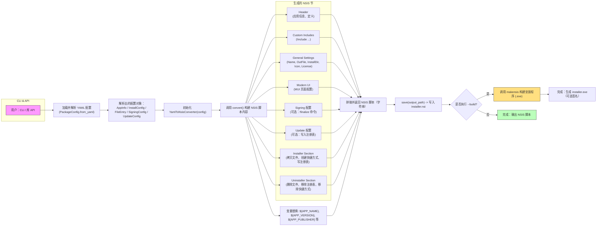

# 工作流程与原理 📦🔧

本文档以图与文字结合的方式说明 `xswl-yaml-nsis` 的工作流程与内部原理，便于理解与扩展。

## 总览



---

## 关键步骤说明 🔍

- 加载配置：使用 `PackageConfig.from_yaml` 将 YAML 文件解析为结构化对象（`AppInfo`、`InstallConfig`、`FileEntry` 等）。
- 转换器：`YamlToNsisConverter` 负责把配置映射成 NSIS 脚本的多个节（header、UI、installer、uninstaller 等），通过 `convert()` 返回完整脚本字符串，`save()` 写入文件。实现位于 `xswl_yaml_nsis/converters/convert_nsis.py`，便于后续扩展其他打包工具。
- 变量替换：模板字符串中会替换 `${APP_NAME}`、`${APP_VERSION}`、`${APP_PUBLISHER}` 等占位符。
- 可选行为：如果开启 `signing`，会在脚本中加入 `!finalize` 签名命令；如果执行 `--build`，CLI 会调用 `makensis` 来生成安装程序。

---

## 扩展点与注意事项 ⚙️

- 自定义 NSIS 片段：通过 `custom_nsis_includes` 可以注入自定义 `!include` 文件来扩展功能。
- 文件模式与递归：转换器遵循常见 glob 语义 —— 仅当源路径包含 `**`（例如 `dir/**/*`）时会使用递归拷贝（生成 `File /r`）。单层 `dir/*` 为非递归。若需要把源目录当作一个根文件夹复制到目标下（例如将 `/a/b/c` 拷贝为 `/m/n/c/...`），可以在 `FileEntry` 或 `packages` 源中使用 `preserve_root: true`。
- post_install：包级 `post_install` 命令会在对应包的 Section 中以 `ExecWait` 的形式执行，适合像驱动安装之类的后置步骤。示例：

```yaml
packages:
  Drivers:
    children:
      PXI_driver:
        sources:
          - source: "./build/.../PXI/**/*"
            destination: "$INSTDIR\\drivers\\PXI"
        post_install:
          - "$INSTDIR\\drivers\\PXI\\installDriver.cmd"
```

- 注册表视图：`SetRegView` 会改变后续注册表操作所使用的视图（32/64位）。转换器在生成时会在每条带 `view` 的 `registry_entries` 之前插入相应的 `SetRegView`，并在卸载阶段同样在删除前设置视图，以确保写入和删除操作发生在期望的注册表视图中。
- 签名：签名配置不会自动执行签名（除非在构建后手动使用 signtool），脚本中会留下 `!finalize` 注释提示。
- 更新：自动更新逻辑需在应用端实现，安装器只负责写入注册表相关配置供应用读取。

---

## 使用示例

CLI:

```
python -m xswl_yaml_nsis.cli examples/simple.yaml --format nsis -o dist/installer.nsi --build --makensis C:\Program Files (x86)\NSIS\makensis.exe -v
```

库 API:

```python
from xswl_yaml_nsis.config import PackageConfig
from xswl_yaml_nsis.converters.convert_nsis import YamlToNsisConverter

cfg = PackageConfig.from_yaml("examples/simple.yaml")
conv = YamlToNsisConverter(cfg)
conv.save("dist/installer.nsi")
```

---

若需进一步细化 Mermaid 图（例如拆分每个生成函数的内部流程或展示文件列表处理细节），请告诉我需要哪一部分的深度。 ✨
