# 工作流程与原理 📦🔧

本文档以图与文字结合的方式说明 `xswl-yaml-nsis` 的工作流程与内部原理，便于理解与扩展。

## 总览

```mermaid
flowchart LR
  subgraph CLI & API
    Start["用户：CLI / 库 API"]
  end

  Start --> ParseConfig["加载并解析 YAML 配置<br>(PackageConfig.from_yaml)"]
  ParseConfig --> ConfigParts["解析出的配置对象：<br>AppInfo / InstallConfig / FileEntry / SigningConfig / UpdateConfig"]

  ConfigParts --> ConverterInit["初始化 YamlToNsisConverter(config)"]
  ConverterInit --> Convert["调用 convert() 构建 NSIS 脚本内容"]

  subgraph Sections[生成的 NSIS 节]
    Header["Header<br>(应用信息、定义)" ]
    Includes["Custom Includes<br>(!include ...)" ]
    GenSettings["General Settings<br>(Name, OutFile, InstallDir, Icon, License)" ]
    UI["Modern UI<br>(MUI 页面配置)" ]
    Signing["Signing 配置<br>(可选：!finalize 命令)" ]
    Update["Update 配置<br>(可选：写入注册表)" ]
    Installer["Installer Section<br>(拷贝文件、创建快捷方式、写注册表)" ]
    Uninstaller["Uninstaller Section<br>(删除文件、移除注册表、移除快捷方式)" ]
  end

  Convert --> Header
  Convert --> Includes
  Convert --> GenSettings
  Convert --> UI
  Convert --> Signing
  Convert --> Update
  Convert --> Installer
  Convert --> Uninstaller

  Header & Includes & GenSettings & UI & Signing & Update & Installer & Uninstaller --> NSISContent["拼接并返回 NSIS 脚本（字符串）"]
  NSISContent --> Save["save(output_path) -> 写入 installer.nsi"]
  Save --> OptionalBuild{"是否执行 --build?"}
  OptionalBuild -->|是| Makensis["调用 makensis 构建安装程序 (.exe)"]
  OptionalBuild -->|否| End["完成：输出 NSIS 脚本"]
  Makensis --> EndBuilt["完成：生成 installer.exe（可选签名）"]

  %% 补充说明：变量替换流程
  Convert --> VarReplace["变量替换: ${APP_NAME}, ${APP_VERSION}, ${APP_PUBLISHER} 等"]
  VarReplace --> NSISContent

  style Start fill:#f9f,stroke:#333,stroke-width:1px
  style End fill:#bfb,stroke:#333,stroke-width:1px
  style Makensis fill:#ffdf80,stroke:#333,stroke-width:1px
```


```

---

## 关键步骤说明 🔍

- 加载配置：使用 `PackageConfig.from_yaml` 将 YAML 文件解析为结构化对象（`AppInfo`、`InstallConfig`、`FileEntry` 等）。
- 转换器：`YamlToNsisConverter` 负责把配置映射成 NSIS 脚本的多个节（header、UI、installer、uninstaller 等），通过 `convert()` 返回完整脚本字符串，`save()` 写入文件。
- 变量替换：模板字符串中会替换 `${APP_NAME}`、`${APP_VERSION}`、`${APP_PUBLISHER}` 等占位符。
- 可选行为：如果开启 `signing`，会在脚本中加入 `!finalize` 签名命令；如果执行 `--build`，CLI 会调用 `makensis` 来生成安装程序。

---

## 扩展点与注意事项 ⚙️

- 自定义 NSIS 片段：通过 `custom_nsis_includes` 可以注入自定义 `!include` 文件来扩展功能。
- 签名：签名配置不会自动执行签名（除非在构建后手动使用 signtool），脚本中会留下 `!finalize` 注释提示。
- 更新：自动更新逻辑需在应用端实现，安装器只负责写入注册表相关配置供应用读取。

---

## 使用示例

CLI:

```
python -m xswl_yaml_nsis.cli examples/simple.yaml -o dist/installer.nsi --build --makensis C:\Program Files (x86)\NSIS\makensis.exe -v
```

库 API:

```python
from xswl_yaml_nsis.config import PackageConfig
from xswl_yaml_nsis.converter import YamlToNsisConverter

cfg = PackageConfig.from_yaml("examples/simple.yaml")
conv = YamlToNsisConverter(cfg)
conv.save("dist/installer.nsi")
```

---

若需进一步细化 Mermaid 图（例如拆分每个生成函数的内部流程或展示文件列表处理细节），请告诉我需要哪一部分的深度。 ✨
